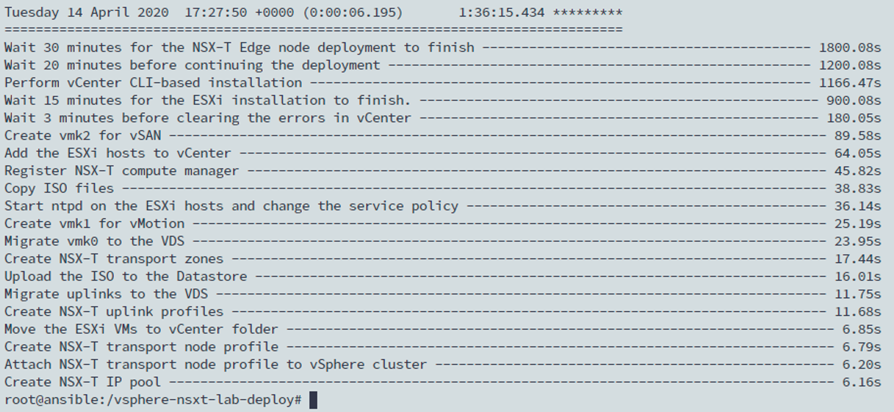
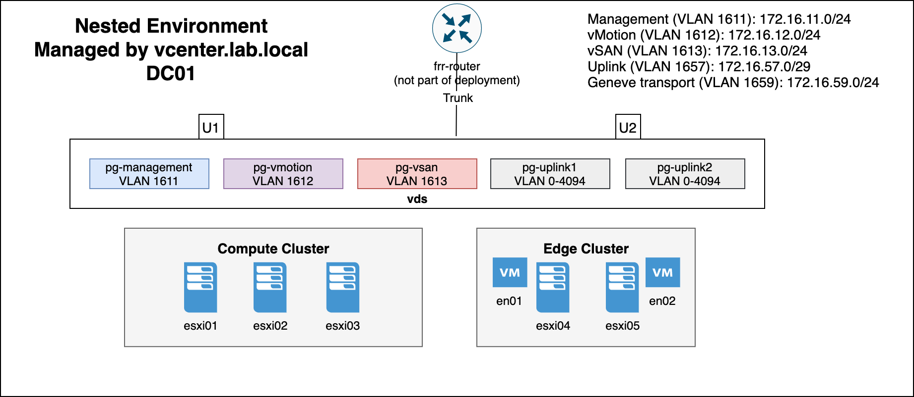

# vsphere-nsxt-lab-deploy
A set of Ansible Playbooks that automate the deployment and configuration of a complete nested vSphere environment and NSX-T.

#### Table of Contents

* [Description](#Description)
* [Changelog](#Changelog)
* [Requirements](#Requirements)
* [Deployment](#Deployment)
* [Diagrams](#Diagrams)
* [Usage](#Usage)
* [Compatibility](#Compatibility)
* [Development](#Development)
* [Credits](#Credits)

## Description

This repository contains a set of Ansible Playbooks that will deploy and configure vCenter, nested ESXi, NSX-T Manager, and NSX-T Edge nodes. The primary use case is speedy provisioning of a consistent nested lab environment.

## Changelog

* **12/04/2020**
  * Initial release

## Requirements

* A physical ESXi host managed by vCenter
* An Ansible Control node (like an Ubuntu 18.04 VM) with:
  * apt install python
  * apt install ansible
  * apt install sshpass python-pip git
  * apt install xorriso
  * pip install pyvim
  * pip install setuptools wheel
  * pip install pyvmomi
  * ovftool (free download from VMware)
  * ESXi and VCSA ISO files as well as the NSX-T Manager OVA file
* For NSX-T you will need an NSX-T license (Check out [VMUG Advantage](https://www.vmug.com/membership/vmug-advantage-membership))

## Deployment

Using the default **deploy.yml** the following is deployed:
1. Create a vSwitch and port groups on the physical ESXi
1. Deploy and configure a vCenter Sever Appliance
1. Deploy 5 ESXi VMs
1. Configure the nested vSphere environment:
   * Configure the ESXi hosts
   * Create and configure a Distributed Switch
   * Add ESXi hosts to vCenter (3 hosts in the "Compute" vSphere cluster and 2 hosts in the "Edge" cluster)
1. Configure NSX-T:
   * Deploy NSX Manager
   * Register vCenter as a Compute Manager in NSX Manager
   * Create NSX-T Transport Zones
   * Create NSX-T IP pool
   * Create NSX-T Uplink Profiles
   * Create NSX-T Transport Node Profile
   * Deploy two NSX-T Edge Transport Nodes
   * Create NSX-T Edge Cluster
   * Attach NSX-T Transport Node Profile to the "Compute" vSphere cluster (this will effectively install NSX-T bits and configuration on the ESXi hosts in that cluster)

Ansible Play recap from 14/04/2020:

### Diagrams

A simple diagram over the physical environment. This will be deployed on the physical ESXi host when using the default settings in **answerfile.yml**

Another diagram showing some more details about the nested vSphere environment. Again using the default settings in **answerfile.yml**

## Usage

Edit the **answerfile.yml** and the **deploy.yml** according to your needs. Start the deployment with:

**ansible-playbook deploy.yml**

## Compatibility

Confirmed to be working with:
* Ubuntu 18.04 as the OS for the Ansible Control node
* Ansible 2.9.6
* ESXi version 6.7 and 7.0
* vCenter version 6.7 and 7.0
* NSX-T version 2.5 and 3.0

## Development

* TODO: Add Playbooks for configuring NSX-T logical networking
* TODO: Optimize / structurize answerfile.yml

## Credits

Credits go to **Yasen Simeonov** and his project at https://github.com/yasensim/vsphere-lab-deploy. This project is largely based on his.
